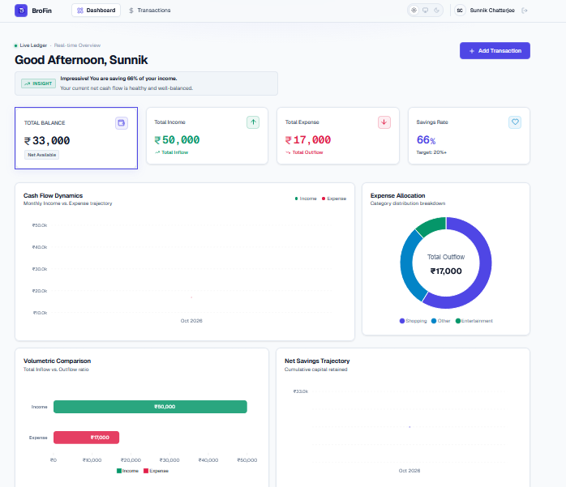
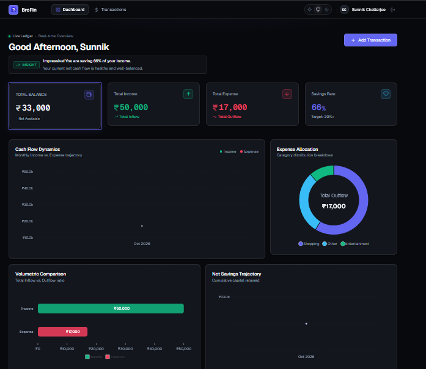
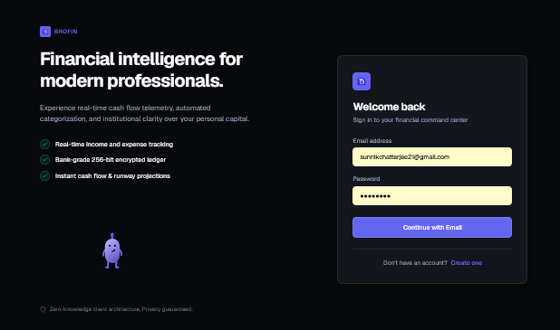
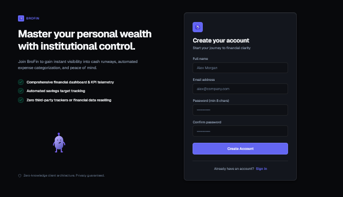
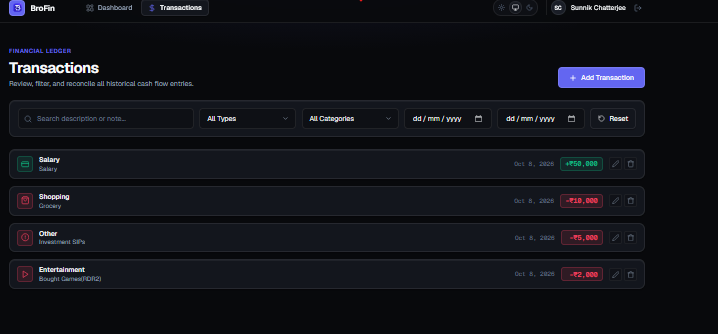
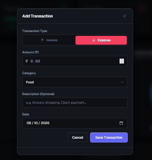

# BroFin

A modern personal finance management platform built with the **MEAN Stack** that helps users track income, expenses, savings, and financial trends through an intuitive dashboard and real-time analytics.

## Live Demo

**Frontend:** https://personal-finance-manager-pearl-omega.vercel.app

**Backend API:** https://personal-finance-manager-xqpg.vercel.app/api/health

---

## Features

### Financial Management
- Track income and expense transactions
- Categorize spending across multiple categories
- Monitor savings rate and cash flow trends
- Search, filter, and paginate transaction history

### Analytics Dashboard
- Real-time financial overview
- Monthly income vs expense visualization
- Expense allocation breakdown
- Automated financial insights
- Savings performance tracking

### Security & Authentication
- JWT-based authentication
- Password hashing with bcrypt
- Protected API routes
- Rate limiting and security headers

### User Experience
- Responsive design
- Dark and light theme support
- Interactive charts with ApexCharts
- Toast notifications and smooth interactions
- Mobile-friendly interface

---

## Screenshots

### Dashboard

| Light Mode | Dark Mode |
|------------|------------|
|  |  |

### Authentication

| Login | Register |
|--------|----------|
|  |  |

### Transactions

| Transaction History | Add Transaction |
|---------------------|-----------------|
|  |  |

---

## Tech Stack

| Layer | Technology |
|---------|------------|
| Frontend | Angular 19, TypeScript, SCSS |
| Backend | Node.js, Express 5 |
| Database | MongoDB Atlas |
| Authentication | JWT, bcryptjs |
| Charts | ApexCharts |
| Animations | Rive |
| Security | Helmet, CORS, Express Rate Limit |
| Deployment | Vercel, Render |

---

## Architecture

```text
personal-finance-manager/
├── backend/
│   ├── src/
│   │   ├── config/
│   │   ├── controllers/
│   │   ├── middleware/
│   │   ├── models/
│   │   ├── routes/
│   │   └── services/
│   └── server.js
│
└── frontend/
    └── finance-ui/
        └── src/
            ├── app/
            │   ├── components/
            │   ├── core/
            │   ├── pages/
            │   └── shared/
            └── environments/
```

---

## Environment Variables

### Backend (`backend/.env`)

```env
PORT=5000
MONGO_URI=your_mongodb_connection_string
JWT_SECRET=your_secret_key
JWT_EXPIRES_IN=7d
CLIENT_URL=http://localhost:4200
```

### Frontend

| File | Purpose |
|--------|---------|
| `environment.ts` | Development configuration |
| `environment.prod.ts` | Production configuration |

---

## Local Development

### Backend

```bash
cd backend
npm install
npm run dev
```

### Frontend

```bash
cd frontend/finance-ui
npm install
ng serve
```

Application runs at:

```text
Frontend: http://localhost:4200
Backend:  http://localhost:5000
```

---

## API Endpoints

| Method | Endpoint | Description |
|----------|-----------|-------------|
| GET | `/api/health` | Health Check |
| POST | `/api/auth/register` | Register User |
| POST | `/api/auth/login` | Login User |
| GET | `/api/transactions` | Get Transactions |
| POST | `/api/transactions` | Create Transaction |
| PUT | `/api/transactions/:id` | Update Transaction |
| DELETE | `/api/transactions/:id` | Delete Transaction |
| GET | `/api/dashboard/summary` | Dashboard Analytics |

---

## Roadmap

- Budget planning
- Spending goals
- Recurring transactions
- CSV/PDF exports
- Google OAuth
- Budget alerts
- Advanced financial insights

---

## Author

**Sunnik Chatterjee**

GitHub: https://github.com/Sunnik-Chatterjee